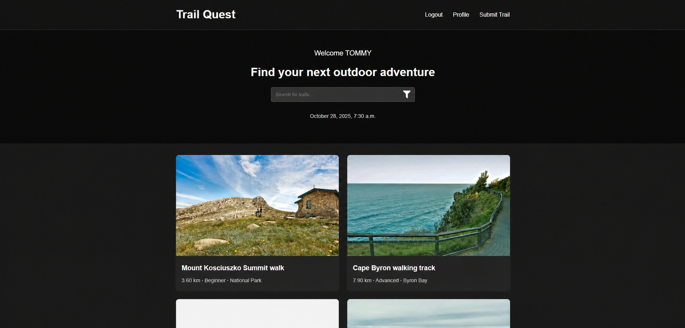
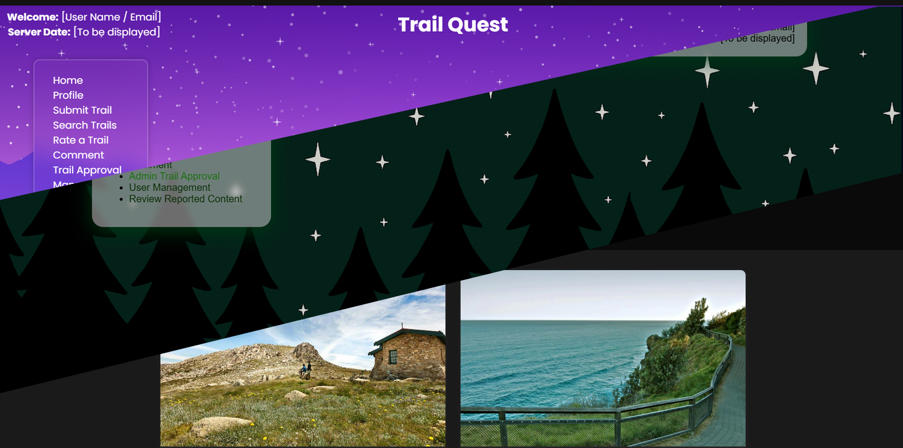

# TRAILQUEST

Find, share and review walking trails across Australia.



## FEATURES

- **Discover:** browse approved trails and search for a walk.
- **Share:** submit trail locations, distances, elevations, difficulty levels and photos.
- **Review:** leave ratings and comments as a registered member.
- **Moderate:** approve or reject trail submissions through the staff dashboard.

## TECH STACK

Python · Django · SQLite · JavaScript · HTML · CSS · Pillow

## QUICK START

With Python 3.12 and pip installed, run these commands from the project folder in PowerShell:

```powershell
py -3.12 -m venv .venv
.\.venv\Scripts\python.exe -m pip install -r requirements.txt
.\.venv\Scripts\python.exe manage.py migrate
.\.venv\Scripts\python.exe manage.py createsuperuser
.\.venv\Scripts\python.exe manage.py runserver
```

Open **http://127.0.0.1:8000/**. The database starts empty; the screenshot shows example trail posts.

Register a separate member account to submit and review trails. Use the superuser account at `/admin-dashboard/` to approve submissions before they appear in the public feed. Staff accounts cannot submit or review trails.


## TESTING

```powershell
.\.venv\Scripts\python.exe manage.py test
```

Tests in `trailQuest/tests/` cover models, views and form submissions, including authentication and invalid inputs. Django creates a separate test database for each run.

## DESIGN EVOLUTION

Early designs used illustrated backgrounds and translucent panels. The current layout puts trail photos, search and key details first, with less visual clutter and layouts that adapt to mobile screens.



## CREDITS

Originally developed by **Tommy Tran** and **Gylles Varga** for Software Engineering Fundamentals at Western Sydney University in 2025.

This version is independently maintained by Tommy.
